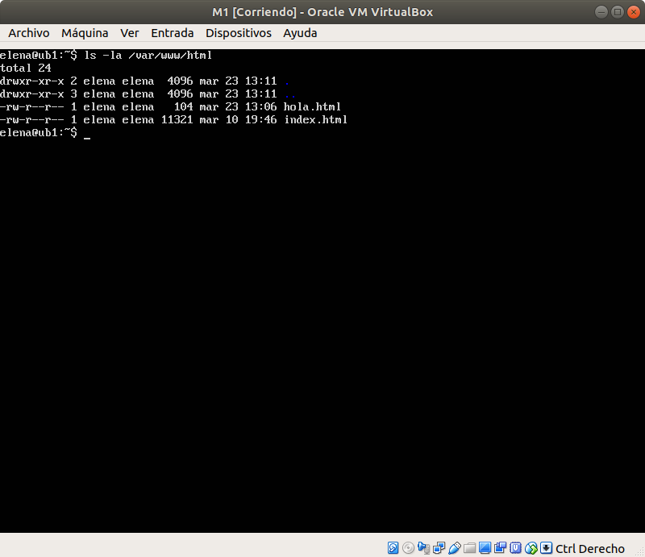
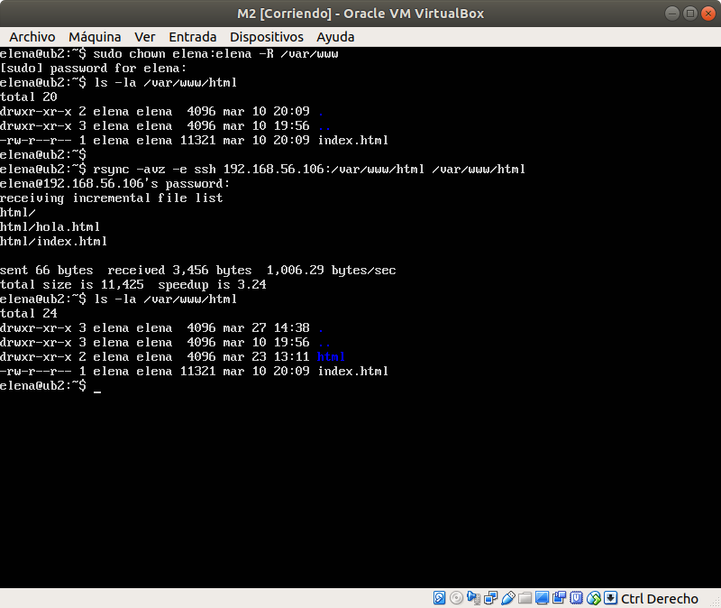

# Practica 2. Clonar la información de un sitio web.
Realizada por Elena María Gómez Ríos y Guillermo Sandoval Schmidt.

## Objetivos
- Aprender a copiar archivos mediante `ssh`.
- Clonar contenido entre máquinas.
- Configurar el `ssh` para acceder a máquinas remotas sin contraseña.
- Establecer tareas en `cron`.

## Instalar la herramienta rsync
En nuestro caso ya está instalado en las máquinas, si no lo estuviese tendríamos que instalarlo mediante `sudo apt-get install rsync`.

Tenemos que dar permisos a la carpeta `/var/www` al usuario en ambas máquinas:  
`sudo chown elena:elena –R /var/www`

Para probar el funcionamiento de `rsync` hemos clonado la carpeta `/var/www/html` de la máquina 1 a la máquina 2 ejecutando el comando:  
`rsync -avz -e ssh 192.168.56.106:/var/www/html /var/www/html`  
haciendo un `ls -la /var/www/html` vemos como se ha clonado la información de la máquina 1 a la máquina 2.

## Acceso sin contraseña para ssh
